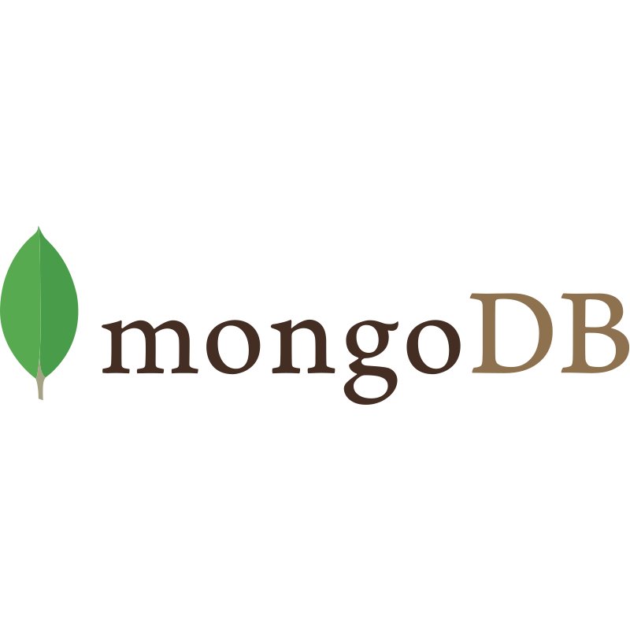

Soy Leonardo Pabón, desarrollador de Software apasionado por la tecnología y el aprendizaje, tecnólogo en sistemas de información y cursando el último semestre de ingeniería.

<h1>Mi Trayecto</h1>

  
<b> PowerBI | SharePoint | Power Automate | Practicas profesionales </b>

  

    2019 mi primer título universitario esta por llegar y para obtenerlo opte por realizar practicas profesionales, estás las desempeño en una empresa llamada Internexa donde un excelente equipo de compras me recibe y me explican sus necesidades, el área requería cambiar la forma en que obtenían las métricas de rendimiento de sus compradores, debía ser más autónoma, que pudiese acceder a la máxima cantida de información de las diferentes herramientas que utilizaba el equipo para lograr esto aprendí como funcionaba el área que función desempeñaban los integrantes del área, que información era útil para su director y luego de ello opte por usar PowerBi para analizar la información obteniendo información a través de herramientas de la suite de office como power automate y sharepoint.
  

  
<b> Quadient | Métodologia agil</b> 

  

    En 2021 emprendo mi camino a través de las herramientas Quadient y un gran equipo de trabajo, nuestro objetivo era asegurar los medios bajo las cuales nuestros clientes generarían las comunicados a sus clientes, estos comunicados podían ser facturas, promociones o notificaciones.
    Mis mayores logros en este episodio de mi vida profesional fue mi rápida adaptación a la tecnología y al equipo recibiendo reconocimiento por ello y confiandome tareas de gran valor.
  

  
 <b>Javascript | PHP | Laravel | Angular | Mysql | SqlServer | Linux | Windows Server</b> 

  

    Finalicé mi etapa trabajando con herramientas Quadient en 2022 y comencé a adentrarme en el mundo del desarrollo web. Ingresé a una compañía con un ambiente de trabajo agradable, tranquilo y colaborativo, donde rápidamente construí buenas relaciones con mis compañeros. Nuestro objetivo era desarrollar soluciones CRM para distintos clientes, y con el tiempo me convertí en un referente técnico dentro del equipo, gracias a mi dedicación y constante estudio.
    En ese momento trabajábamos con SuiteCRM, una solución lista para producción que servía como base para personalizar las plataformas según las necesidades de cada cliente. Cada implementación variaba significativamente, ya que los procesos de negocio eran muy distintos, lo que me permitió aprender a fondo el funcionamiento de la herramienta y dominar su extensión.
    Con el tiempo, identifiqué varias limitaciones en SuiteCRM, por lo que propuse migrar a una arquitectura moderna basada en Laravel para el backend y Angular para el frontend, separando responsabilidades y mejorando la mantenibilidad del código. Esta propuesta fue aceptada, y junto a un compañero llevamos a cabo el primer proyecto bajo este nuevo enfoque, el cual resultó exitoso y se convirtió en un modelo de referencia para futuros desarrollos en la empresa.
  

  
 <b>Javascript | React | Node.js | GCP | Kubernetes | Nats | MongoDB | Lua | RxJS | MQTT | GraphQL</b>

  

    Buscando expandir mis horizontes en 2024, finalicé mi etapa trabajando con PHP y me enfoqué completamente en el desarrollo con JavaScript. Asumí el rol de desarrollador Middle en una compañía con un equipo de alto nivel técnico, lo que representó una gran oportunidad de aprendizaje y crecimiento.
    Durante esta etapa, adquirí experiencia práctica en arquitecturas de microservicios y su comunicación a través de eventos, además de aplicar los principios de Domain-Driven Design (DDD), conocimientos que ya venía estudiando y que en este entorno también eran fundamentales. Tuve mi primer acercamiento real a bases de datos no relacionales, especialmente con MongoDB, lo que amplió significativamente mi perspectiva sobre el manejo de datos.
    Uno de mis aprendizajes más significativos fue el dominio de la arquitectura de microservicios, así como la comprensión del funcionamiento de aplicaciones en la nube, específicamente en Google Cloud Platform. Además, fortalecí mi enfoque en el rendimiento y la escritura de código escalable, alineado con los estándares y exigencias de la compañía. 
  

 
<h1>Herramientas y Lenguajes</h1>

  <!-- FrontEnd -->
  <!-- Bootstrap -->
  
  <!-- CSS -->
  
  <!-- TAILWIND -->
  
  <!-- HTML -->
  
   <!-- REACT -->
  
  <!-- ANGULAR -->
  
  

  <!-- TOOLS -->
  <!-- GIT -->
  
  <!-- LINUX -->
  
   <!-- NATS -->
  
  <!-- GOOGLE CLOUD -->
  
  <!-- MQTT -->
  
  <!-- DOCKER -->
  
  <!-- RXJS -->
  
  <!-- GRAPHQL -->
  
  

  <!-- LANGUAGES -->
  <!-- NODEJS -->
  
  <!-- PHP -->
  
  <!-- LARAVEL -->
  
  <!-- JAVASCRIPT -->
  
  <!-- LUA -->
  

  <!-- BASES DE DATOS -->
  <!-- MONGO -->
  
   <!-- MYSQL -->
  
   <!-- SQL SERVER -->
  
 

  

 
<h1>Contáctame</h1>

